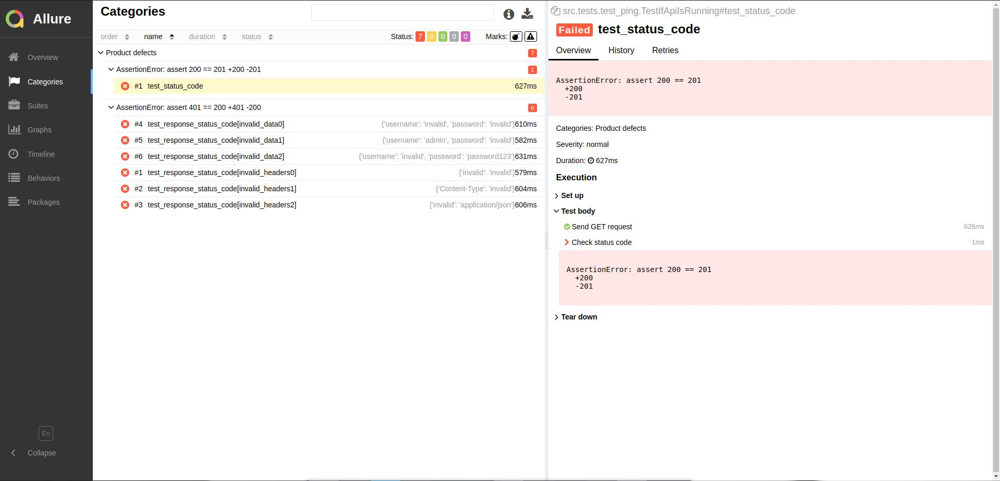

# Python API automation project 
- Python 3.x
- Pytest 
- Requests
- Allure Framework

## Requirements
1) Install Python
   [python.org](https://www.python.org/downloads/)
2) Install Allure to use web reporting
   [docs.qameta.io/allure](https://docs.qameta.io/allure/#_installing_a_commandline)

## How to use
1) Create and activate virtual environment
```bash
# Navigate to the project folder
cd python-api-automation

# Create virtual environment
python -m venv venv

# Activate virtual environment
source venv/bin/activate
```
2) Install all required Python packages
```bash
pip install -r requirements.txt
```

3) Launch all tests and show web report
```bash
dt=$(date '+%Y_%m_%d/%H_%M_%S');
pytest -v -s --alluredir="reports/$dt/" . ;
allure.png serve reports/$dt/
```

## Report example
### Overview

### Categories

### Suites

### Graphs

### Timeline

### Behaviors

### Packages
